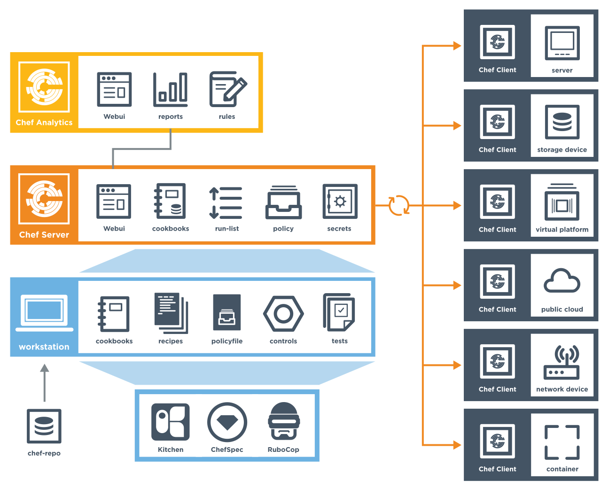
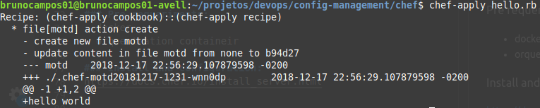

# Chef


- **Gerenciador de configuração**
-  Sua arquitetura:

<br/>

- Cookbook prontas: https://supermarket.chef.io/dashboard
Ex supermarket:<br/>
```bash
knife supermarket install postgresql
```

-  **Exemplo**: instalar o Apache em 100 máquinas.
  -  É possível fazer um script bash, em seguida acessar máquina por máquina para instalar a aplicação.
  -  Com o chef é possível criar uma _recipes_ de instalação do apache e inserir num **cookbook**. Basta executar 1 vez que ele instala nos 100 nodes.
  -  Caso seja necessário alterar alguma coisa basta mudar a _recipe_ e reexecutar.

---
## Recipes
São os scripts de instalação e configuração.

#### Example 1
1. Create _recipe_: hello.rb
```ruby
file 'output_file' do 
	content 'hello world'
end
```

2. Run recipe<br/>
```bash
chef-apply hello.rb
```



- Será gerado um arquivo chamado motd contendo: hello world

#### Example 2

1. Create _recipe_: recipe-web-server.rb
```ruby
# install package with apt/dpkg
package 'apache2'

service 'apache2' do
  supports status: true
  action [:enable, :start]
end

file '/var/www/html/index.html' do
  content 
  '<html>
	  <body>
	  	<h1>Life is not about how hard of a hit you can give... it is about how many you can take, and still keep moving forward. </h1>
	  </body>
</html>'
end
```

2. Run recipe<br/>
```bash
sudo chef-apply recipe-web-server.rb
```

3. Open browser in http://localhost/80 or `curl localhost`

---

## Cookbook


#### Estrutura de diretórios do cookbook
- recipes
- templates
- Resource — é algo que descreve um componente da infraestrutura - arquivo, modelo , pacote etc;
- readme.md
- metada - dados sobre a receita, quem desenvolveu, versões suportadas, version, depends.

Example cookbook install apache:<br/>
```
cookbooks
└── cookbook-web-server-apache
    ├── Berksfile
    ├── CHANGELOG.md
    ├── chefignore
    ├── LICENSE
    ├── metadata.rb
    ├── README.md
    ├── recipes
    │   └── default.rb
    ├── spec
    │   ├── spec_helper.rb
    │   └── unit
    │       └── recipes
    │           └── default_spec.rb
    └── test
        └── integration
            └── default
                └── default_test.rb

8 directories, 10 files
```

### Hands-on

#### Example create cookbooks:
1. Create repository<br/>
```bash
mkdir cookbooks
```

2. Create _cookbook_: web-server-apache<br/>
```bash
chef generate cookbook cookbooks/cookbook-web-server-apache
```

3. Edit recipe _default.rb_<br/>
```ruby
# Cookbook:: web-server-apache
# Recipe:: default

# install package with apt/dpkg
package 'apache2'

service 'apache2' do
  supports status: true
  action [:enable, :start]
end

file '/var/www/html/index.html' do
  content 
  '<html>
	  <body>
	  	<h1>Life is not about how hard of a hit you can give... it is about how many you can take, and still keep moving forward. </h1>
	  </body>
</html>'
end
```
4. Execute recipe in a cookbook<br/>
```bash
sudo chef-client --local-mode --runlist 'recipe['cookbook-web-server-apache']'
```

---


---
## Bizus

```
- Knife = roles
- berks = recipes
- chef  = cockbook
```

---
## Update
- Update cookbook
- Update recipe
- Update role


### Update cookbook

- Check cockbook's install in machine:<br/>
```bash
cd /etc/chef; \
cat first-boot.json	# output: {"run_list":"role[NAME_ROLE]"}
```

- Run a cookbook:<br/>
```bash
sudo chef-client <NAME_COOKBOOK>
```

## Update recipe

- Make changes and upload to chef server, after run:<br/>
```bash
berks upload <NAME_RECIPE> --force
```

e.g, without update version in `metadata.rb`:<br/>
```bash
berks upload platform-repos --force
```

- Vá na máquina provisionada e rode o chef novamente:<br/>
```bash
sudo chef-client -o "recipe[NAME_COOKBOOK::NAME_RECIPE]"
```

## Update role
```bash
knife upload from file roles/<NAME_ROLES.rb>
```

---

## Remove machine of chef-client

### Drop 
```bash
cd /$HOME/platform-chef-repo/
knife node delete platform-luigi-08 --yes
knife client delete platform-luigi-08 --yes
```

or

```
knife ec2 server delete i-0a8d49b68d37e8e9e --node-name platform-luigi-08 --purge
```
Apague a maquina no EC2 > instances

### Problem berks install
```bash
gem update --system 2.7.5
```

## Author
- Bruno Aurélio Rôzza de Moura Campos (brunocampos01@gmail.com)
## Copyright
<a rel="license" href="http://creativecommons.org/licenses/by-sa/4.0/"></a><br />This work by <span xmlns:cc="http://creativecommons.org/ns#" property="cc:attributionName">Bruno A. R. M. Campos</span> is licensed under a <a rel="license" href="http://creativecommons.org/licenses/by-sa/4.0/">Creative Commons Attribution-ShareAlike 4.0 International License</a>.