# Git


## <a href="#linux"></a> **System Control Version**
### [Understanding git](git/README.md)
### Best Practices
- [How to write: Commits](git/how_to_write_commits.md)
- [How to write: Branches](git/how_to_write_branches.md)
- [How to write: Readme](git/how_to_write_readme.md)
- [Types of LICENSE](https://choosealicense.com/)
### Git Files
  - [Understanding Local Directory: .git]()
  - [Example: .gitconfig](git/.gitconfig)
  - [Example: .gitignore](git/.gitignore)
  - [Example: .gitattributes](git/.gitattributes)
  - [Example: .gitkeep](git/.gitkeep)

## Summary

- Understanding git

- [Instalation](#instalation)
  - System Install
  - Configuration parameters (user, ignore, …)
  - Push and pull configurations

- [Authenticating to Github](#authenticationg-to-github)

- Git Areas
  - working area
  - Stash area
  - Staging area
  - Local repository (HEAD)
  - Remote repository

- Basic Commands
  - Commit https://help.github.com/en/categories/commits
  - Upload
  - Download - https://help.github.com/en/articles/syncing-a-fork
  - Creating a first repository
  - Adding or removing files
  - Moving and deleting files
  - Commit, checkout, reset
  - Displaying commit history and moving inside

- Branch management
  - Introduction to branches and HEAD Definition
  - Branch creation
  - Branch navigation
  - Branch merge and rebase

- Git inspect
  - git show
  - git diff
  - git status
  - git describe

- Git debug
  - Bisect (detect when insered bug)
  - git blame
  - git grep

- Git management
  - git clean
  - git gc
  - git reflog
  - git log
  - git reset

- GIT best practices on a Project
    GitFlow : a branch model (https://guides.github.com/introduction/flow/)
    Code reviews using Gerrit, GitLab or GitHub
    Best practices to use GIT on your project

- Searching
  - Git fetch X git pull
  - Diff
  - Merge
  - git remote
  - Resolve conflits
  - Tags
  - Submodule
  - Hook
  - git checkout
  - git merge
  - git submodules
  - Releases & Version Tags - https://help.github.com/en/articles/about-releases
  - gist https://help.github.com/en/categories/gists
  - https://help.github.com/en/articles/using-keyboard-shortcuts (AMAZING!!!!!!!)
 - Advanced Git
   - rebase - https://help.github.com/en/categories/advanced-git

- https://help.github.com/en#github-pages-basics
- https://comandosgit.github.io/#patching
- http://marklodato.github.io/visual-git-guide/index-en.html
- https://learngitbranching.js.org/

---

## Understanding

- Tutorial: http://rogerdudler.github.io/git-guide/index.pt_BR.html
- OfficialEbook: https://git-scm.com/book/pt-br/v1/Primeiros-passos-Sobre-Controle-de-Vers%C3%A3o
- https://www.slideshare.net/origamiaddict/git-get-ready-to-use-it
- http://ndpsoftware.com/git-cheatsheet.html
- https://medium.com/@porteneuve/mastering-git-reset-commit-alchemy-ba3a83bdfddc
- https://www.gitkraken.com/git-client#merge-editor

 ---

## Install
 ```bash
 sudo apt-get install git
 ```

 ### Install gitk (GUI)
 ```bash
 sudo apt-get install gitk
 ```

### Git Init Configuration
- Before install, It's necessary st user.name and user.email.

```bash
git config --global user.name "John Doe"
git config --global user.email johndoe@example.com
git config --global core.editor vim
git config --global color.ui true
```

- Check config
```bash
git config --list

# user.name=brunocampos01
# user.email=brunocampos01@gmail.com
# core.editor=vim
# color.ui=true
# color.ui=auto
# color.branch.current=yellow bold
# color.branch.local=green bold
# color.branch.remote=cyan bold
# color.diff.meta=yellow bold
# color.diff.frag=magenta bold
# color.diff.old=red bold
# color.diff.new=green bold
# color.diff.whitespace=red reverse
# color.status.added=green bold
# color.status.changed=yellow bold
# color.status.untracked=red bold
# web.browser=google-chrome
# core.repositoryformatversion=0
# core.filemode=true
# core.bare=false
# core.logallrefupdates=true
# remote.origin.url=git@github.com:brunocampos01/web_development.git
# remote.origin.fetch=+refs/heads/*:refs/remotes/origin/*
```

---

## Authenticating to Github

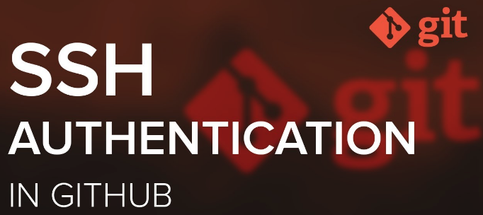

### Install ssh
```bash
sudo apt install openssh-server
sudo apt install openssh-client
```

### Check status
```bash
sudo systemctl status ssh
```

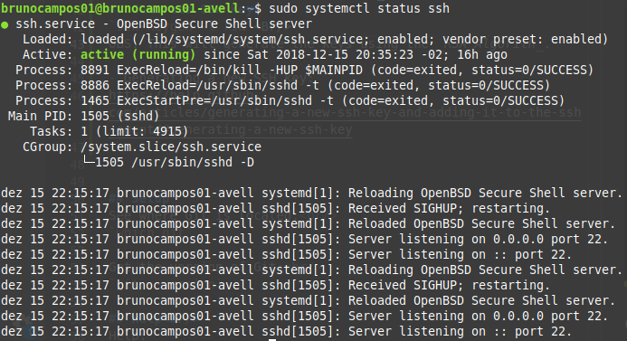


### Generate SSH public and private Key
```bash
ssh-keygen -t rsa
```

OBS: This will generate the keys using the _RSA Algorith_.
OBS: By default the public key is saved in the file `~/.ssh/id_rsa.pub`, while `~/.ssh/id_rsa` is the private key.

### Generating a new SSH key:
https://help.github.com/articles/generating-a-new-ssh-key-and-adding-it-to-the-ssh-agent/#generating-a-new-ssh-key

### Adding a new SSH key to your GitHub account:
https://help.github.com/articles/adding-a-new-ssh-key-to-your-github-account/

### Testing your SSH connection
```bash
ssh -T git@github.com
```

**References**
- https://help.github.com/en/categories/authenticating-to-github

---

## Set Local Repository

 


If project start in personal computer is possible configurate with a remote (github).

```bash
git init
git remote add <name_remote> <url_ssh>
```

NOTE: if use url git@github, the config ssh to this repo is ACTIVATE.

- Check config of local repository
```bash
git remote -v

# origin	git@github.com:brunocampos01/web_development.git (fetch)
# origin	git@github.com:brunocampos01/web_development.git (push)
```
---

# Git Areas

### Local


### Local + Remote

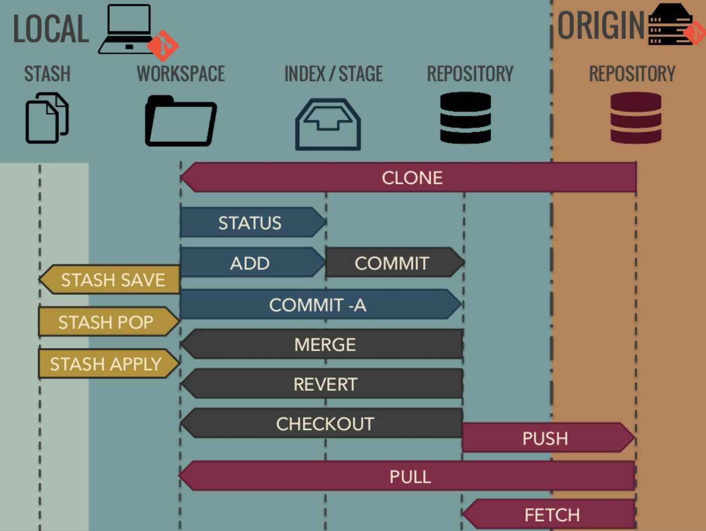

- Stash area
- working area
- Staging area
- Local repository (HEAD)
- Remote repository

## Stash (esconderijo)

Use `git stash` quando quiser gravar o estado atual do diretório de trabalho e do índice, mas quiser voltar para um diretório de trabalho limpo. O comando salva suas modificações locais e reverte o diretório de trabalho para corresponder ao HEAD commit.

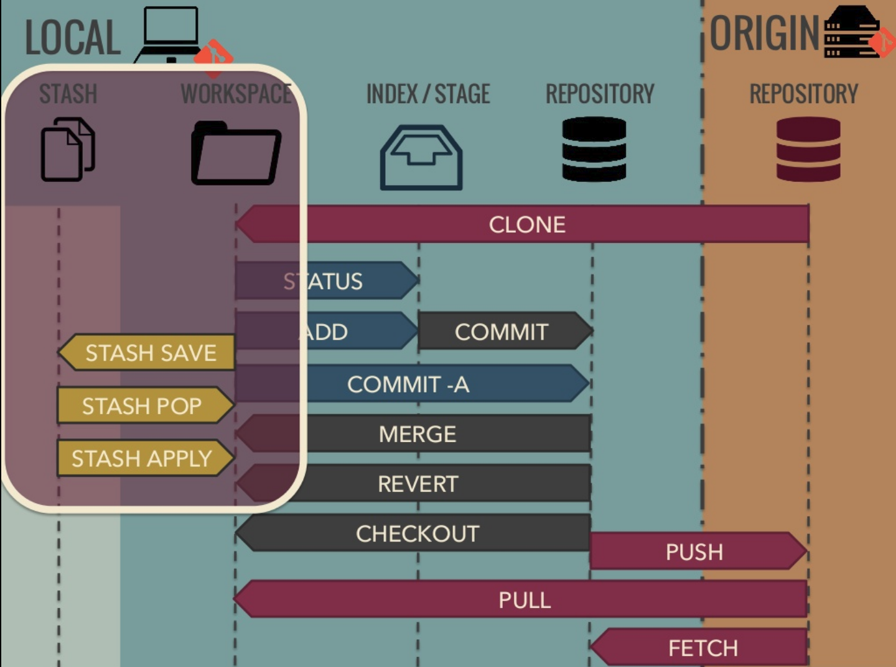

##### Put in stash

```bash
git stash save "Message"
```

##### Show modify in stash

```bash
git stash list
```

##### Show stash changes

```bash
git stash show -p stash@{0}
```

##### Restore to workspace

```bash
git stash apply
```

##### Delete custom stash item

```bash
git stash drop stash@{0}
```

##### Delete complete stash

```bash
git stash clear
```

#### Advantage stash area

When `git pull` give conflit. In this case, it's possible stash local changes to permit `git pull`, example:

```bash
$ git pull
 ...
file foobar not up to date, cannot merge.
$ git stash save
$ git pull
$ git stash pop
```

## Staging (index)

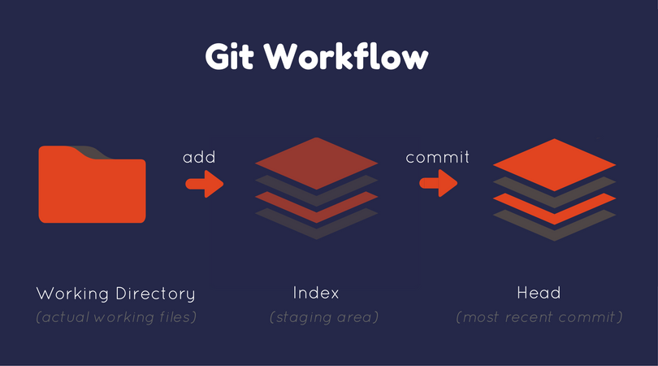


To add our files to the staging area:
```bash
git add blah.txt
git status
```

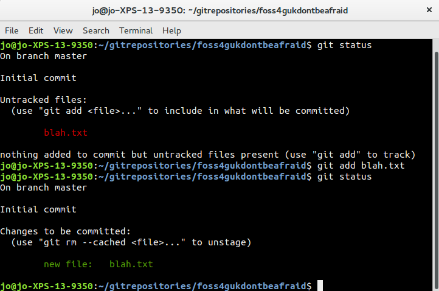


Git commits files from the "staged files" list, also called "indexed files".

The git add command will not add dropped files by default.

It's possible use `git stage`

- To add everything files in stage area:
`git add --all`

- Trakear em **everything** os arquivos e diretórios correntes:
`git add . `

- Add spefic file
`git add index.html`

- Trakear somente as alterações:
`git add -u`

- Add each change in a file:
```bash
git add -p <file-name>
git add --patch <file-name>
```

## Basic Comands

## Setup

See where Git is located
```bash
which git
```

Get the version of Git
```bash
git --version
```

Help
```bash
git help
```

Check Configuration
```bash
git config --list
```

Ex:
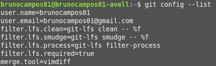

---

### Integration github and PC

 


1. Open directory local (in PC) with thes files to upload to github:

```bash
user@name_pc ~/projetos/projetos_JAVA/
```

2. Inicialize o git:

```bash
git init
```

#### 3. Track files

Há vários tipos de trackear os dados para o git.

##### Arquivo em especifico

```bash
git add index.html
```

##### Trakear em **everything** os arquivos e diretórios

```bash
git add .
```

##### Trakear somente as alterações

```bash
git add -u
```

##### Add e commit em uma única etapa

```bash
git commit -am "Message"
```

#### 4. Check Status

```bash
git status
```

#### 5. Enviar para o git
```bash
git commit -m "commit inicial"
```

---

## Upload github
1. É necessário saber o servidor remoto (repositório do github), Ex: <br/>
`https://github.com/brunocampos01/NOME_DIRETORIO`

2. Agora é necessário informar que esse servidor remoto é a origin: <br/>
`git remote add origin https://github.com/brunocampos01/NOME_DIRETORIO`

**Origin ?**
- origin é um _alias_ para o servidor remoto.
- Ele aponta para o servidor remoto.

3. faça o envio

```bash
git push origin branchname
```


**Caso de erro de FETCH_HEAD, use:** <br/>
`git pull origin master --allow-unrelated-histories`

---

### Download github
1. Abra o diretório no PC onde se deseja atualizar:<br/>
`git pull`
ou <br/>
`git pull -force`

---

## Clean and Remove

### Remove in PC
Diretório local: <br/>
`git rm -r NOME_DIRETORIO`

### Remove in cache
- Para não enviar ao github
- Quando já foi trackeado os arquivos mas ainda não foi feito o commit.<br/>
`git rm --cached <arquivo>`<br/>


### Did you digress from what you did?

1. First view modified<br/>
`git status`

2. Do checkout in file<br/>
`git checkout -- <file_name_modifield>`


### Remove in github
Remove somente o diretório do GITHUB e mantem o diretorio no PC.
1. Primeiro abra o terminal do PC no diretório. <br/>
```
git rm -r --cached FolderName
git commit -m "Removed folder from repository"
git push origin master
```

Remove files from Git:<br/>
`git rm index.html`<br/>

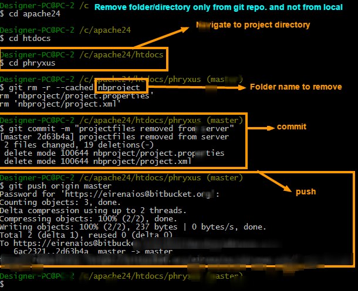

### Remove changes commited
`git reset HEAD~1`


### Reedit menssage commit
`git commit --amend`
- edit last message commit
---

## Commit

Um commit é um documento que descreve uma alteração, um ponto na linha do tempo do projeto.

 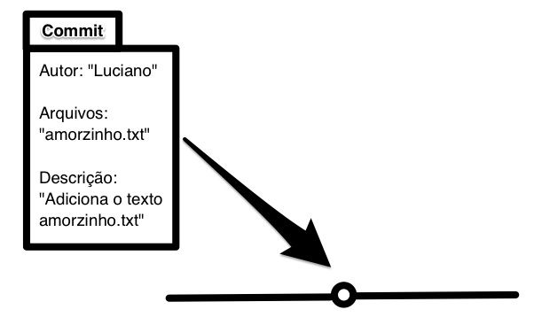


#### Understanding a deeper commit
É arquivo encriptado em SHA-1 que armazena metadados de:
- tree (é o hash da árvore de commits)
- parents (de qual último node da tree esta vindo)
- Autor
- Committer
- commit date
- Menssagem de commit

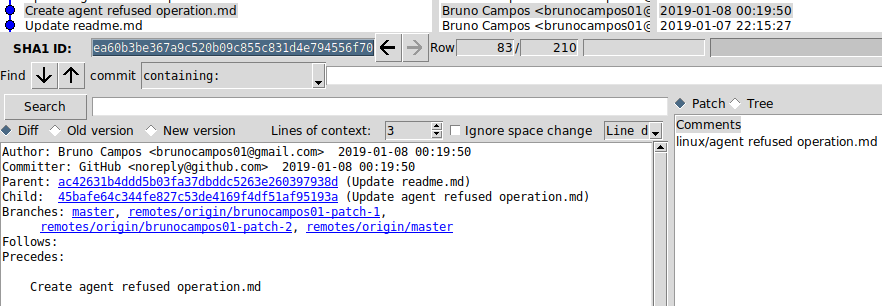


```sh
sha1(
    commit message  => "second commit"
    committer        => campos <campos@gmail.com>
    commit date     => Sat Nov 8 11:13:49 2014 +0100
    author          => bruno campos <brunocampos01@gmail.com>
    author date     => Sat Nov 8 11:13:49 2018 +0100
    tree            => 9c435a86e664be00db0d973e981425e4a3ef3f8d
    parents         => [0d973e9c4353ef3f8ddb98a86e664be001425e4a]
)
```


1. Commit each change in a file
 `git add -p pom.xml `


## Working with paths in pull request
Open rebase,:<br/>
`git rebase -i master`

IMG

### Cocatenate equals paths
IMG rebase
IMG rebase with fixup

### Edit only message commits
IMG rebase
IMG rebase with reword

## Branch


Show branches (local):<br/>
`git branch`

Show all branches (remote + local):<br/>
`git branch --all`

Create branch:<br/>
`git branch branchname`

Change to branch:<br/>
`git checkout branchname`

Create and change to new branch:<br/>
`git checkout -b branchname`

Delete merged branch (only possible if not HEAD):<br/>
`git branch --delete branchname`

Delete not merged branch: <br/>
`git branch -D branch_to_delete`

##### Delete branch remote

```bash
git push --delete origin NAME_BRANCH
```

##### Delete branch local

```bash
git branch --delete NAME_BRANCH
```

##### Download specific branch
```bash
git clone --single-branch --branch <branchname> host:/dir.git
```

---
## Git remote configuration

### View configuration git remote (server)
`git remote -v`

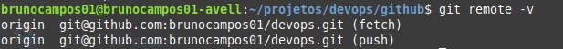

### Create a new connection to a remote repository
`git remote add <name> <url>`<br/>
OBS: by default name connection is _origin_ .


### Remove a connection to a remote repository
`git remote remove <name>`


---

## Release and Tags


### Semantic Versioning

```
MAJOR.MINOR.PATCH

X.Y.Z

1.9.6
```

1. **MAJOR** version, é quando são alterações que fazem o código antigo ficar incompatível
2. **MINOR** version, nova feature
3. **PATCH** version, quando corrigir falhas mantendo compatibilidade.

O bizu é começar um projeto com 0.1.0, ncrementar a uma versão ‘menor’ em cada lançamento subsequente.


---
---
## Global Settings

- Related Setup: https://gist.github.com/hofmannsven/6814278
- Related Pro Tips: https://ochronus.com/git-tips-from-the-trenches/
- Interactive Beginners Tutorial: http://try.github.io/
- Git Cheatsheet by GitHub: https://services.github.com/on-demand/downloads/github-git-cheat-sheet/


Remove file but do not track anymore:
`git rm --cached index.html`

Move or rename files:
`git mv index.html dir/index_new.html`

Undo modifications (restore files from latest commited version):
`git checkout -- index.html`

Restore file from a custom commit (in current branch):
`git checkout 6eb715d -- index.html`


## Reset

Go back to commit:
`git revert 073791e7dd71b90daa853b2c5acc2c925f02dbc6`

Soft reset (move HEAD only; neither staging nor working dir is changed):
`git reset --soft 073791e7dd71b90daa853b2c5acc2c925f02dbc6`

Undo latest commit: `git reset --soft HEAD~ `

Mixed reset (move HEAD and change staging to match repo; does not affect working dir):
`git reset --mixed 073791e7dd71b90daa853b2c5acc2c925f02dbc6`

Hard reset (move HEAD and change staging dir and working dir to match repo):
`git reset --hard 073791e7dd71b90daa853b2c5acc2c925f02dbc6`

## Update & Delete

Test-Delete untracked files:
`git clean -n`

Delete untracked files (not staging):
`git clean -f`

Unstage (undo adds):
`git reset HEAD index.html`

Update most recent commit (also update the commit message):
`git commit --amend -m "New Message"`


## Merge

True merge (fast forward):
`git merge branchname`

Merge to master (only if fast forward):
`git merge --ff-only branchname`

Merge to master (force a new commit):
`git merge --no-ff branchname`

Stop merge (in case of conflicts):
`git merge --abort`

Stop merge (in case of conflicts):
`git reset --merge` // prior to v1.7.4

Merge only one specific commit:
`git cherry-pick 073791e7`

Rebase:
`git checkout branchname` » `git rebase master`
or:
`git merge master branchname`
(The rebase moves all of the commits in `master` onto the tip of `branchname`.)

Cancel rebase:
`git rebase --abort`

Squash multiple commits into one:
`git rebase -i HEAD~3` ([source](https://www.devroom.io/2011/07/05/git-squash-your-latests-commits-into-one/))

---

## Files Git

### .gitconfig
...

### .gitattributes
...

### .gitignore

- About: https://help.github.com/articles/ignoring-files
- Useful templates: https://github.com/github/gitignore


### .gitkeep
- Track empty dir
```bash
touch .gitkeep
```

**NOTE**: It's better create a file README.md each repository to keep (temporary) empty.

---

## Log

Show commits:
`git log`

Show oneline-summary of commits:
`git log --oneline`

Show oneline-summary of commits with full SHA-1:
`git log --format=oneline`

Show oneline-summary of the last three commits:
`git log --oneline -3`

Show only custom commits:
`git log --author="Sven"`
`git log --grep="Message"`
`git log --until=2013-01-01`
`git log --since=2013-01-01`

Show only custom data of commit:
`git log --format=short`
`git log --format=full`
`git log --format=fuller`
`git log --format=email`
`git log --format=raw`

Show changes:
`git log -p`

Show every commit since special commit for custom file only:
`git log 6eb715d.. index.html`

Show changes of every commit since special commit for custom file only:
`git log -p 6eb715d.. index.html`

Show stats and summary of commits:
`git log --stat --summary`

Show history of commits as graph:
`git log --graph`

Show history of commits as graph-summary:
`git log --oneline --graph --all --decorate`


Compare
-----------

Compare modified files:
`git diff`

Compare modified files and highlight changes only:
`git diff --color-words index.html`

Compare modified files within the staging area:
`git diff --staged`

Compare branches:
`git diff master..branchname`

Compare branches like above:
`git diff --color-words master..branchname^`

Compare commits:
`git diff 6eb715d`
`git diff 6eb715d..HEAD`
`git diff 6eb715d..537a09f`

Compare commits of file:
`git diff 6eb715d index.html`
`git diff 6eb715d..537a09f index.html`

Compare without caring about spaces:
`git diff -b 6eb715d..HEAD` or:
`git diff --ignore-space-change 6eb715d..HEAD`

Compare without caring about all spaces:
`git diff -w 6eb715d..HEAD` or:
`git diff --ignore-all-space 6eb715d..HEAD`

Useful comparings:
`git diff --stat --summary 6eb715d..HEAD`

Blame:
`git blame -L10,+1 index.html`


Releases & Version Tags
-----------

Show all released versions:
`git tag`

Show all released versions with comments:
`git tag -l -n1`

Create release version:
`git tag v1.0.0`

Create release version with comment:
`git tag -a v1.0.0 -m 'Message'`

Checkout a specific release version:
`git checkout v1.0.0`


Collaborate
-----------

Show remote:
`git remote`

Show remote details:
`git remote -v`

Add remote upstream from GitHub project:
`git remote add upstream https://github.com/user/project.git`

Add remote upstream from existing empty project on server:
`git remote add upstream ssh://root@123.123.123.123/path/to/repository/.git`

Fetch:
`git fetch upstream`

Fetch a custom branch:
`git fetch upstream branchname:local_branchname`

Merge fetched commits:
`git merge upstream/master`

Remove origin:
`git remote rm origin`

Show remote branches:
`git branch -r`

Show all branches:
`git branch -a`

Create and checkout branch from a remote branch:
`git checkout -b local_branchname upstream/remote_branchname`

Compare:
`git diff origin/master..master`


Pull specific branch:
`git pull origin branchname`

Fetch a pull request on GitHub by its ID and create a new branch:
`git fetch upstream pull/ID/head:new-pr-branch`

Clone to localhost:
`git clone https://github.com/user/project.git` or:
`git clone ssh://user@domain.com/~/dir/.git`

Clone to localhost folder:
`git clone https://github.com/user/project.git ~/dir/folder`

Clone specific branch to localhost:
`git clone -b branchname https://github.com/user/project.git`

Delete remote branch (push nothing):
`git push origin :branchname` or:
`git push origin --delete branchname


## Diff Tool


 


Pre requeriments: <br/>
`sudo apt install vim`<br/>

É a ferramenta utilizada para resolver conflitos de merge (fusão).<br/>
 `git config --global merge.tool vimdiff`<br/>
 Ex:

 

 ---
