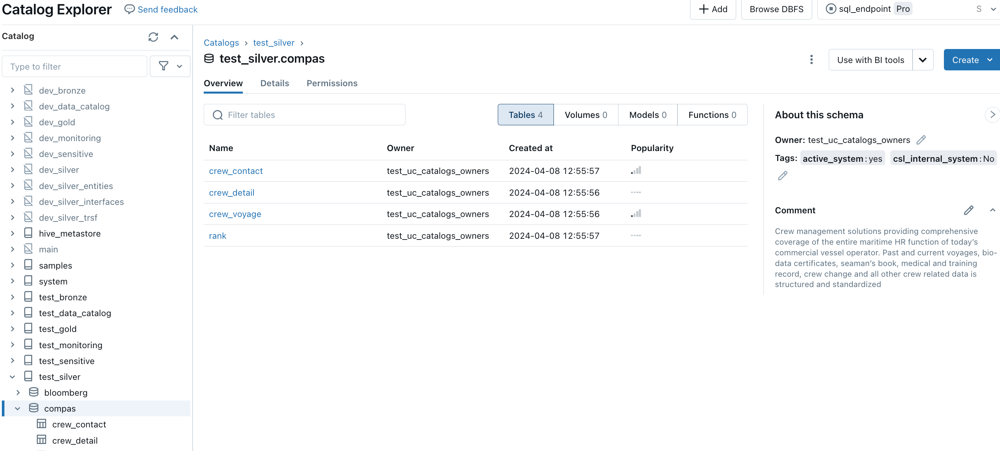
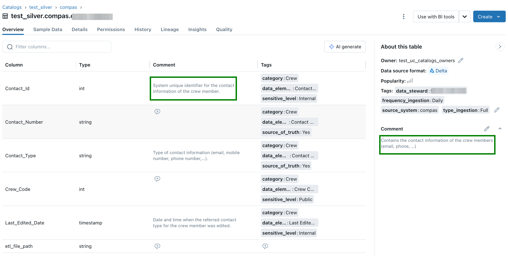
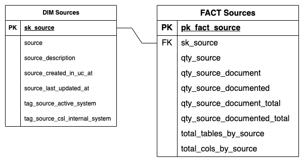
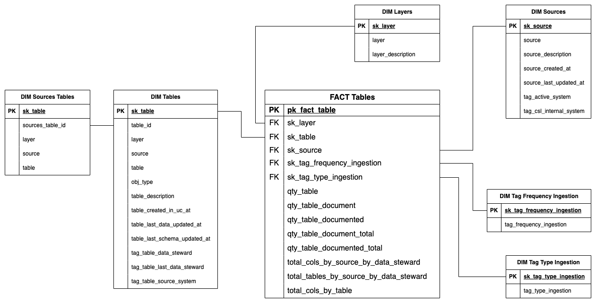
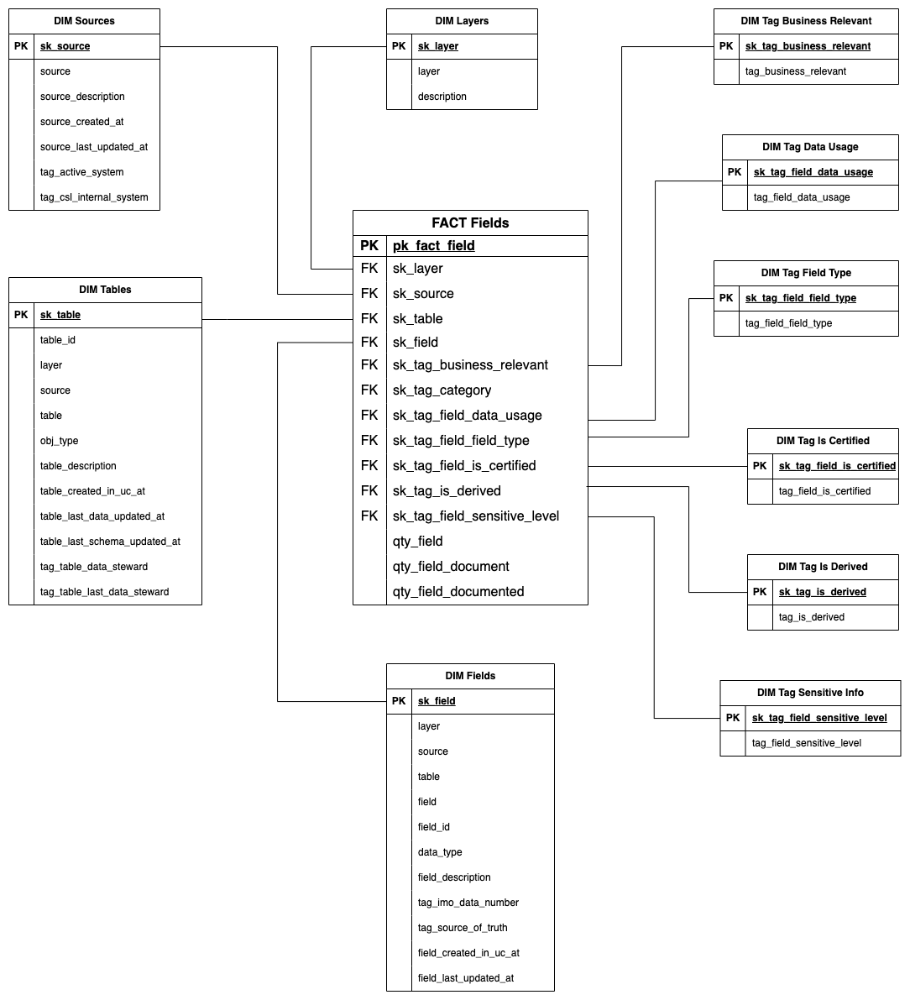
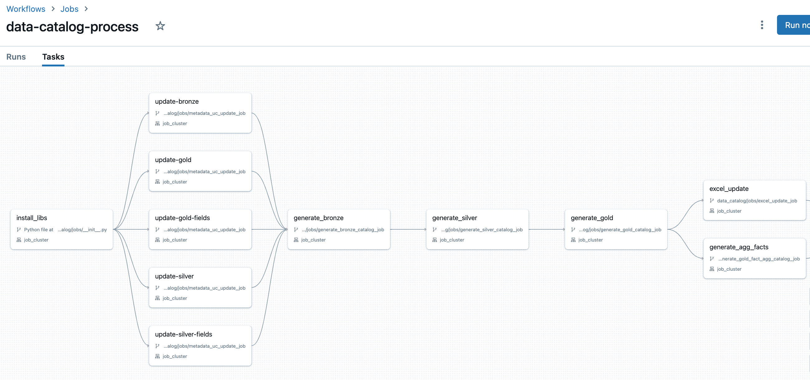

# Data Catalog Project
[](https://www.python.org/downloads/release/python-381/)

## Project's Scope
The scope of this project consists of building processes to populate the metadata mapped in the data documentation project into the data lake (descriptions, tags, properties and characteristics of the fields).
Based on the metadata ingested to the data lake, generate visual representations of the data lake that can be explored by management, business and IT teams though Power BI dashboards.

## Project's Goal
Populate all data gathered in the data documentation project to the Unity Catalog. Generate a Dashboard to give visibility.





## Requirements
| Requisite          | Version                                            |
| ------------------ | -------------------------------------------------- |
| Python             | 3.10.12                                            |
| Pip                | 22.2.2                                             |
| Databricks runtime | 13.3 LTS (includes Apache Spark 3.4.1, Scala 2.12) |

- A user with permissions to read and write the magellanadlsdev containers (Azure Storage Account)

<!-- ## Install
```sh
pip install --require-hashes -r requirements.txt
```

## Features
TODO
-->

## How to Run
1. On Databricks, open Workflows.
2. Select the `data_catalog-process`
3. Click in Run now


## Dimensions and Facts Tables
Star schema for fact_sources:



Star schema for fact_tables:



Star schema for fact_fields:



## Workflow


---
