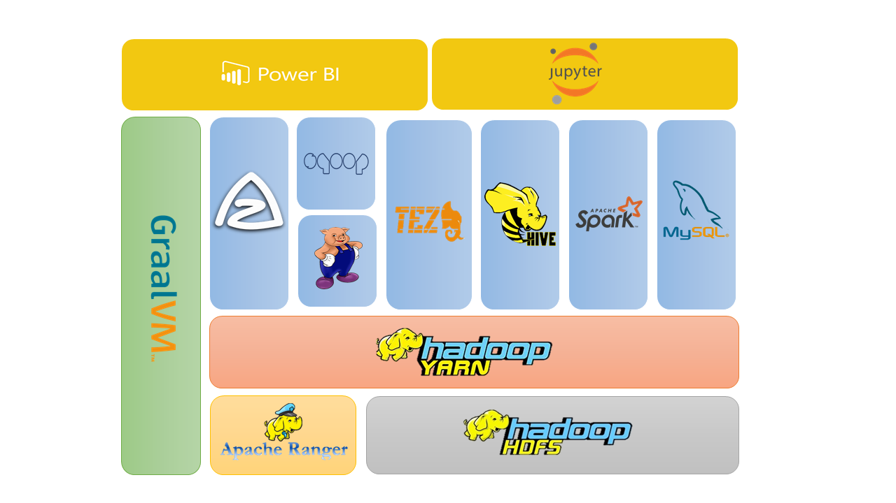
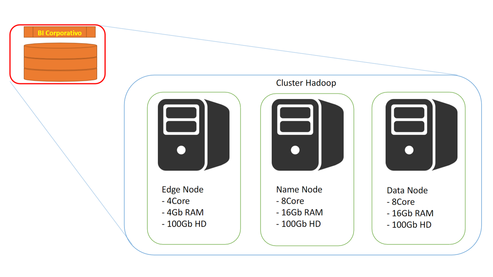

> This is an example of data lake using Apache Hadoop technologies in on-premises environment

# **XPTO Company Data Lake**
In large organizations, such as XPTO Company, large volumes of data are generated every day, both in relation to the end customers inherent in the business, as well as those resulting from corporate processes, such as: billing, hiring and termination, satisfaction surveys, career etc. Due to the need to improve management processes as a whole in relation to data-driven decision-making, the organization started to consume corporate data in a decentralized and uncontrolled manner, resulting in inconsistency of information, difficulty in accessing data, lack of feasibility for statistical analysis of different data sources, redundancy of work in isolated initiatives by different teams and units for the same purpose, absence of information holders, low efficiency of solutions (local and non-scalable), among others.
<br/>
As a result of these problems, in order to centralize corporate data to make the organization's decision-making more agile, accurate and accessible, this project's value proposition is to preserve, centralize and democratize all relevant corporate information for decision-making in the XPTO Company's business spectrum.
<br/>
The Data Lake foundation will be instituted by the Corporate DataDriven team, which will be responsible for developing and maintaining a DaaS environment for storing, handling, modeling and making available corporate unit data and information to link the data to better business decisions.

## **Goals**
1. Provide a pluggable self-service BI service across multiple platforms
2. On-demand architectural scalability
3. High performance read and write support
4. Machine learning processing support
5. Unlock insights and data value from all business and enterprise areas
6. Establish corporate data governance

## Layers
1. Data Lake: raw data storage
2. Data Warehouse under Data Lake: centralized warehouse for data cube and OLAP
3. Applications and solutions: BI dashboards, artificial intelligence, statistical analysis from different sources

The technologies used in this project separated by responsible node in the cluster are:


<br/>

### **Name Node**
| Tecnology |         |
|-----------|---------|
| GraalVM   | 19.0.0  |
| Hadoop    | 3.1.2   |
| Tez       | 0.9.2   |


### **Data Node**
| Tecnology |         |
|-----------|---------|
| GraalVM   | 19.0.0  |
| Hadoop    | 3.1.2   |
| Tez       | 0.9.2   |

### **Edge Node**
| Tecnology  |        |
|------------|--------|
| Spark      | 2.4.3  |
| Sqoop      | 1.4.7  |
| Hive       | 3.1.1  |
| Kylin      | 2.6.3  |
| Ranger     | 1.2.0  |
| Azkaban    | 3.57.0 |
| JupyterLab | 1.0    |

<br/>

The suggested minimum hardware requirements:


## Azkaban
To run azkaban stream packaging run:
```bash
gradle zipAzFlow
```
