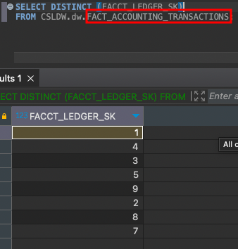
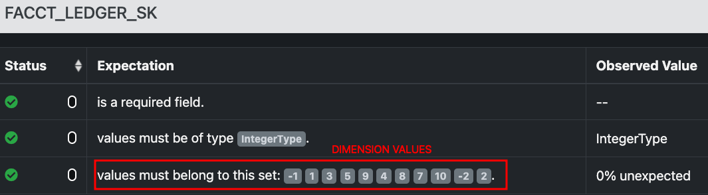

_To better visualization of this document, click here(azure devops)_

# QA Testing Facts Tables: Lift & Shift

## How to Create an Orchestrator
1. Create orchestrator notebook for each domain, e.g. `orchestrator_<domain>_fact`
2. Create sql query file at `tests/qa/liftshift/sql/<domain>/fact/<fact_table_name>.sql`
3. Open the notebook that you created and prepare the parameters.

### Example Parameters Orchestrator for a Fact
- Example without constraints
```python
execution_parameters = {
    "query_path": "sql/finance/fact/fact_accounting_transactions.sql",
    "catalog_name": "XPTOdw",
    "schema_name": "dw",
    "table_name": "fact_accounting_transactions",
    "table_type": "fact",
    "list_fact_business_cols": None,
}
```

- Example with constraints
```python
# It is necessary to create a dict of dimesions to execute referential integraty test
# Structure of the dict:
#     dim name: PK name
# dims inside the query (related with facts)
dict_dims_relationalships = {
    'DIM_ACCOUNTING_COMPANY': 'ACCT_COMPANY_SK',
    'DIM_ACCOUNTING_PROJECT': 'ACCT_PROJECT_SK',
    'DIM_ACCOUNTING_TRANS_INFO': 'ACCT_TRANS_SK',
    'DIM_DIVISION': 'DIVISION_SK',
    'DIM_COST_CENTER': 'COST_CENTER_SK',
    'DIM_FISCAL_PERIOD': 'FISC_PERIOD_SK',
    'DIM_LEDGER': 'LEDGER_SK',
    'DIM_CURRENCY': 'CURRENCY_SK',
    'DIM_PILLAR': 'PILLAR_SK',
    'DIM_TIME': 'DATE_SK',
}

execution_parameters = {
    "query_path": "sql/finance/fact/fact_accounting_transactions.sql",
    "catalog_name": "XPTOdw",
    "schema_name": "dw",
    "table_name": "fact_accounting_transactions",
    "table_type": "fact",
    "list_fact_business_cols": str(list_fact_business_cols),
    "dict_dims_relationalships": str(dict_dims_relationalships),
}
```

NOTES:
- `query_path`:
  - this file must contains a valid query without semicollon and with breakline in the last row.
  - the query must contains in SELECT every fact column used in JOINS. Example:
  ```
  SELECT
  ...
  FROM XPTODW.dw.FACT_ACCOUNTING_TRANSACTIONS FACAT
    INNER JOIN XPTODW.dw.DIM_ACCOUNT DAC                  ON DAC.ACCOUNT_SK = FACAT.FACCT_ACCOUNT_SK
 ...
  ```
    - In this case, `FACCT_ACCOUNT_SK` must to declare in SELECT statement
      ```
      SELECT
        FACAT.FACCT_ACCOUNT_SK,
        ...
        FROM XPTODW.dw.FACT_ACCOUNTING_TRANSACTIONS FACAT
         INNER JOIN XPTODW.dw.DIM_ACCOUNT DAC                  ON DAC.ACCOUNT_SK = FACAT.FACCT_ACCOUNT_SK
      ...
      ```
- `table_type`: fact or dim


## Data Tests
For each table are execute these data tests:
```
################### GREAT EXPECTATIONS FAILED! ##################
expect_column_unique_value_count_to_be_between               True
expect_column_to_exist                                       True
expect_column_same_scale                                     True
expect_same_content_rows                                     True
expect_column_same_sqlserver_datatype                        True
expect_column_same_encoding                                  True
expect_column_values_to_be_of_type                           True
expect_table_column_count_to_equal                           True
expect_column_values_to_not_be_null                          True
expect_column_values_to_be_in_set                            True
expect_corresponding_dims                                    False
expect_column_same_precision                                 True
expect_column_same_datetime_precision                        True
expect_column_same_character_maximum_length                  True
expect_table_row_count_to_equal                              True
#################################################################
```
This log is show in orchestrators notebooks.

### Expect equal count by rows
- **What this test do?** This test verifies whether the row count in the observed dataset matches the expected dataset.
- **Expectation's name**: `expect_table_row_count_to_equal`
- [Documentation of expectation](https://greatexpectations.io/expectations/expect_table_row_count_to_equal?filterType=Backend%20support&gotoPage=undefined&showFilters=true&viewType=Completeness&subFilterValues=spark)
- **Type of tables that this test is executed**: fact and dim

### Expect equal count by columns
- **What this test do?** This data test is designed to verify whether the column count of an observed DataFrame (`df_observed`) matches the expected column count of another DataFrame (`df_expected`).
- **Expectation's name**: `expect_table_column_count_to_equal`
- [Documentation of expectation](https://greatexpectations.io/expectations/expect_table_column_count_to_equal?filterType=Backend%20support&gotoPage=undefined&showFilters=true&viewType=Completeness&subFilterValues=spark)
- **Type of tables that this test is executed**: fact and dim

### Expect column exists
- **What this test do?** Loop through each column name in the DataFrame and create an expectation for its existence.
- **Expectation's name**: `expect_column_to_exist`
- [Documentation of expectation](https://greatexpectations.io/expectations/expect_column_to_exist?filterType=Backend%20support&gotoPage=undefined&showFilters=true&viewType=Completeness&subFilterValues=spark)
- **Type of tables that this test is executed**: fact and dim
- **Columns**: `df_expected.columns`

### Expect same type (Spark)
- **What this test do?** Expect a column to contain values of a specified data type.
- **Expectation's name**: `expect_column_values_to_be_of_type`
- [Documentation of expectation](https://greatexpectations.io/expectations/expect_column_values_to_be_of_type?filterType=Backend%20support&gotoPage=undefined&showFilters=true&viewType=Completeness&subFilterValues=spark)
- **Type of tables that this test is executed**: fact and dim
- **Columns**: `list_col_names_target` and `list_col_types_target`

### Expect column not be null
- **What this test do?** Expect the column values to not be null.
- **Expectation's name**: `expect_column_values_to_not_be_null`
- [Documentation of expectation](https://greatexpectations.io/expectations/expect_column_values_to_not_be_null?filterType=Backend%20support&gotoPage=undefined&showFilters=true&viewType=Completeness&subFilterValues=spark)
- **Type of tables that this test is executed**: fact and dim
- **Columns**: `list_cols_not_be_null`

### Expect same total unique count values rows per columns
- **What this test do?** This data test verify the uniqueness of values in specific columns of the data. It aims to ensure that the number of unique values observed in a column matches the number of unique values expected in that column.
- **Expectation's name**: `expect_column_unique_value_count_to_be_between`
- [Documentation of expectation](https://greatexpectations.io/expectations/expect_column_unique_value_count_to_be_between?filterType=Backend%20support&gotoPage=undefined&showFilters=true&viewType=Completeness&subFilterValues=spark)
- **Type of tables that this test is executed**: fact and dim
- **Columns**: `list_business_cols`
- **NOTES**:
  - Great Expectations doesn't have a specific expectations to do this (08/2023). We use `expect_column_unique_value_count_to_be_between` and do a workaround to perform the test.

### Expect exists referential integrity between fact and dim
- **What this test do?** This test checks the referential integrity between a fact table and its associated dimension values. It ensures that values in the specified fact table column are within the expected set of dimension values.
- **Expectation's name**: `expect_column_values_to_be_in_set`
- [Documentation of expectation](https://greatexpectations.io/expectations/expect_column_values_to_be_in_set?filterType=Backend%20support&gotoPage=undefined&showFilters=true&viewType=Completeness&subFilterValues=spark)
- **Type of tables that this test is executed**: fact
- **Columns**: `list_fact_sk`, `list_dim_pk` and `lists_dim_values`
- **NOTES**:
  - The test is executed by checking the referential integrity of the fact table.
  - To perform this test is necessary to validate that constraints (Surrogate Keys) exists.
  - It is requires a map between names of fact SK and dim PK. Example:
  ```python
        +---------------+--------------------+--------------------+
        |         dim_pk|             fact_sk|          dim_values|
        +---------------+--------------------+--------------------+
        |ACCT_PROJECT_SK|FACCT_ACCT_PROJEC...|[31, 85, 65, 53, ...|
        |    DIVISION_SK|FACCT_COMPANY_REG...|[-1, 1, 6, 3, 5, ...|
        ...
        +---------------+--------------------+--------------------+
  ```
  - In summary, we generate a collection with every distinct PK from dim table and check if all values from fact SK is contained in this collection. If a value only exists in SK fact table we have an orphaned value.
  - Great Expectations doesn't have a specific expectations to do this (08/2023). We use `expect_column_values_to_be_in_set` and do a workaround to perform the test.
- Example:





### Expect Corresponding Dimensions with Measures
- **What this test do?** Check the measures with corresponding dims business key column(s) for each involved dimensions.
- **Expectation's name**: `expect_same_content_rows`
- **Type of tables that this test is executed**: fact
- **The requires of this test**: *"So...other than the Readme file to make sure to mention that you guys are truly covering the SQL datatypes comparisons checks, we have noticed that the measures have to be tested *with corresponding dimensions business key column(s), for each involved dimensions* Ex.: with Account_Code for Dim_Account and not Account_SK.If you have a or some doubts about any business column(s) for a specific DIMension, we would have to check and confirm first together the one(s) that we have the most unique / distinct ( most of the time none NuLL ) values which is not a surrogate_key : as Account_Code."*


### Expect content row match
- **What this test do?** Check if the row content are equal (just business columns)
- **Expectation's name**: `expect_same_content_rows`
- **Type of tables that this test is executed**: fact and dim
- **Output msg example**: `The content rows match. Checked 9213 rows. | Checked for these cols: ['ACCOUNT_CODE', 'LEDGER_CODE', 'CURRENCY_CODE', 'CURRENCY_NAME', 'COST_CENTER_CODE']`

### Expect sqlserver datatype match
- **What this test do?** This test check in both enviroment the column: `DATETIME_PRECISION` from INFORMATION_SCHEMA table if the property are equal.
- **Expectation's name**: `expect_column_same_sqlserver_datatype`
- **Type of tables that this test is executed**: fact and dim
- **Output msg example**: `The data types match in both environments. Verified for these cols: ['FACCT_ACCTD_CR_AMOUNT', 'FACCT_ACCTD_DR_AMOUNT']`
- **NOTES**
  - If execute for fact tables, this test only test fact columns. Example: `['FACCT_ACCOUNT_SK', 'FACCT_LEDGER_SK', 'FACCT_CURRENCY_SK', 'ETL_CREATED_DATE', 'ETL_CREATED_PROCESS_ID']` here we have every columns that exists in fact table but dimensions columns that exists in this query fact will not test.

### Expect column same character maximum length
- **What this test do?** This test check in both enviroment the column: `CHARACTER_MAXIMUM_LENGTH` from INFORMATION_SCHEMA table if the property are equal.
- **Expectation's name**: `expect_column_same_character_maximum_length`
- **Type of tables that this test is executed**: fact and dim
- **Output msg example**: `The same_character_maximum_length match in both environments. Verified for these cols: ['FACCT_ACCTD_CR_AMOUNT', 'FACCT_ACCTD_DR_AMOUNT']`
- **NOTES**:
  - This validation is only executed if the row at INFORMATION_SCHEMA is not null
  - If every columns doesn't have this property, the test will send: `This property is empty for all columns. Test skipped.`

### Expect column same precision
- **What this test do?** This test check in both enviroment the column: `NUMERIC_PRECISION` from INFORMATION_SCHEMA table if the property are equal.
- **Expectation's name**: `expect_column_same_precision`
- **Type of tables that this test is executed**: fact and dim
- **Output msg example**: `All columns have matching numeric precisions. Verified for these cols: ['FACCT_ACCTD_CR_AMOUNT', 'FACCT_ACCTD_DR_AMOUNT']`
- **NOTES**:
  - This validation is only executed if the row at INFORMATION_SCHEMA is not null
  - If every columns doesn't have this property, the test will send: `This property is empty for all columns. Test skipped.`

### Expect column same scale
- **What this test do?** This test check in both enviroment the column: `NUMERIC_SCALE` from INFORMATION_SCHEMA table if the property are equal.
- **Expectation's name**: `expect_column_same_scale`
- **Type of tables that this test is executed**: fact and dim
- **Output msg example**: `All columns have matching numeric scales. Verified for these cols: ['FACCT_ACCTD_CR_AMOUNT', 'FACCT_ACCTD_DR_AMOUNT']`
- **NOTES**:
  - This validation is only executed if the row at INFORMATION_SCHEMA is not null
  - If every columns doesn't have this property, the test will send: `This property is empty for all columns. Test skipped.`

### Expect column same datetime_precision
- **What this test do?** This test check in both enviroment the column: `DATETIME_PRECISION` from INFORMATION_SCHEMA table if the property are equal.
- **Expectation's name**: `expect_column_same_datetime_precision`
- **Type of tables that this test is executed**: fact and dim
- **Output msg example**: `All columns have matching datetime precision. Verified for these cols: ['FACCT_ACCTD_CR_AMOUNT', 'FACCT_ACCTD_DR_AMOUNT']`
- **NOTES**:
  - This validation is only executed if the row at INFORMATION_SCHEMA is not null
  - If every columns doesn't have this property, the test will send: `This property is empty for all columns. Test skipped.`

### Expect column same encoding
- **What this test do?** This test check in both enviroment the column: `COLLATION_NAME` from INFORMATION_SCHEMA table if the property are equal.
- **Expectation's name**: `expect_column_same_encoding`
- **Type of tables that this test is executed**: fact and dim
- **Output msg example**: `All columns have matching encodings. Verified for these cols: ['FACCT_ACCTD_CR_AMOUNT', 'FACCT_ACCTD_DR_AMOUNT']`
- **NOTES**:
  - This validation is only executed if the row at INFORMATION_SCHEMA is not null
  - If every columns doesn't have this property, the test will send: `This property is empty for all columns. Test skipped.`

---
