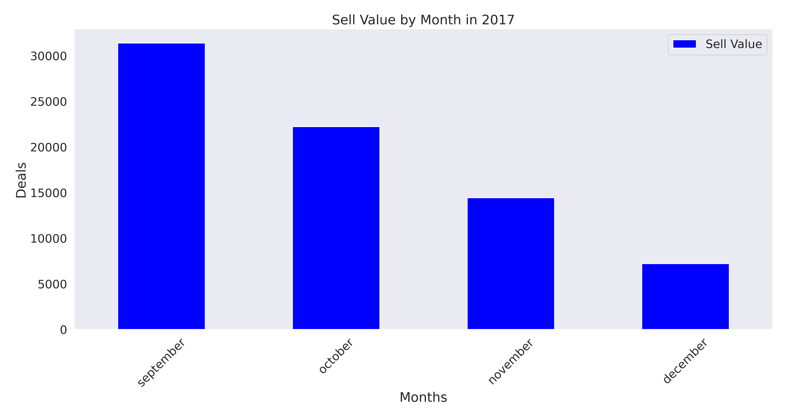
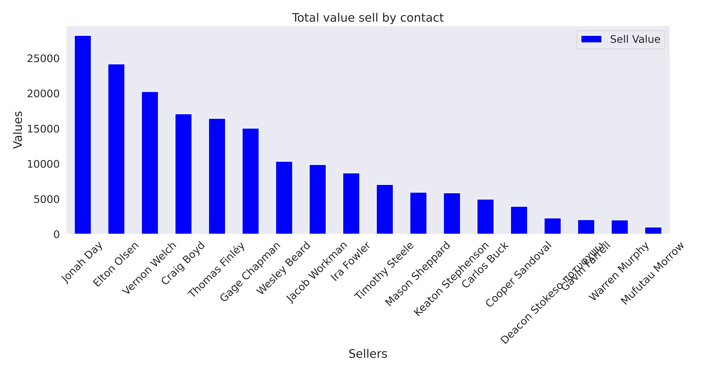

# **Finding Interesting Business Metrics**
[](https://www.python.org/downloads/release/python-391/)


## **Describe Project**
Analysis raw data to find interesting business metrics.

## Objectives
Prepare data to generate visualization.

## Data Source
- [companies](data/raw/companies.tsv)
- [contacts](data/raw/contacts.tsv)
- [deals](data/raw/deals.tsv)
- [sectors](data/raw/sectors.tsv)

## Algorithms
Only data exploration and data cleaning

## Quickstart
[EDA - exploratory data analysis](notebooks/eda.ipynb)

## Requirements
This project is tested with:

| Requisite      | Version |
|----------------|---------|
| Python         | 3.10    |
| Pip            | 21.2.4  |

I recommend using Python [venv](https://github.com/brunocampos01/becoming-an-expert-python#what-is-a-virtual-environment-and-how-it-works).

#### Install Libraries
```
pip install --require-hashes -r requirements.txt
```

## **Image Display**




<br/>

---

<p  align="left">
<br/>
<a href="mailto:brunocampos01@gmail.com" target="_blank">
</a>
<a href="https://stackoverflow.com/users/8329698/bruno-campos" target="_blank">
</a>
<a href="https://www.linkedin.com/in/brunocampos01" target="_blank"></a>
<a href="https://github.com/brunocampos01" target="_blank"></a>
<a href="https://medium.com/@brunocampos01" target="_blank">
</a>
<a rel="license" href="http://creativecommons.org/licenses/by-sa/4.0/"></a><br/>
</p>
