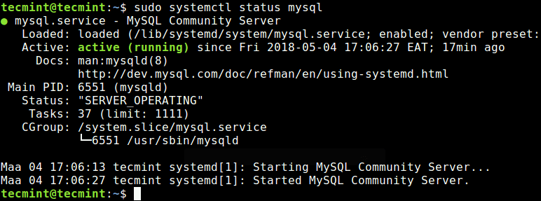

# Install MySQL

## Update APT
- https://dev.mysql.com/downloads/repo/apt/
```bash
wget -c https://dev.mysql.com/get/mysql-apt-config_0.8.10-1_all.deb 
sudo dpkg -i mysql-apt-config_0.8.10-1_all.deb
sudo apt update
```

## Install packages
```bash
sudo apt-get install -y mysql-server
```

### Check Status
```bash
sudo systemctl status mysql
```



### Install Extra MySQL Products and Components

```bash
wget --verbose http://archive.ubuntu.com/ubuntu/pool/universe/libz/libzip/libzip4_1.1.2-1.1_amd64.deb
sudo chmod 777 libzip4_1.1.2-1.1_amd64.deb
sudo dpkg --install libzip4_1.1.2-1.1_amd64.deb

sudo apt-get update
sudo apt-get install mysql-workbench-community \
                     libmysqlclient18
```

---

# Principal Comands 
### Run MySQL in terminal
``` 
mysql -h localhost -u USER -p

-u: username
-p: password (**no space between -p and the password text**)
-h: host
```

### Create Database
```
CREATE DATABASE airflow DEFAULT CHARACTER SET utf8 COLLATE utf8_unicode_ci;

SHOW GLOBAL VARIABLES LIKE '%timestamp%';
SET GLOBAL explicit_defaults_for_timestamp = 1;
```

### Create user
```
CREATE USER 'campos'@'localhost' IDENTIFIED BY ''deitel';
GRANT SELECT, INSERT, UPDATE, DELETE, CREATE, DROP, REFERENCES,
EXECUTE ON *.* to 'campos'@'localhost';
```

### Update Privileges
```mysql
SHOW schemas;
GRANT ALL PRIVILEGES ON *.* TO 'root'@'localhost';
FLUSH PRIVILEGES;

SELECT DISTINCT HOST, User FROM mysql.user;

-- output
+------------------+--------------+
| user             | host         |
+------------------+--------------+
| root             | localhost    |
| debian-test-user | localhost    |
| johnsm           | localhost    |              
| brian            | localhost    |            
| root             | 111.111.111.1|              
| guest            | %            |              
| adrianr          | 10.11.12.13  | 
+------------------+--------------+
7 rows in set (0.01 sec)
```

### Config File
- `/etc/mysql/my.cnf`
